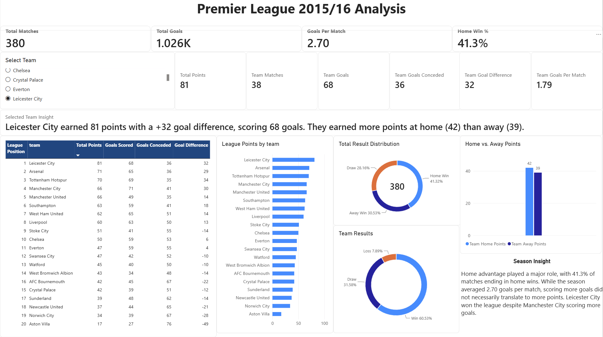

# Premier League 2015/16 Data Analysis

This project analyzes match data from the 2015/16 English Premier League season to explore team performance, scoring, results, and home vs. away performance. I used Python and pandas to clean and prepare the data, SQL to analyze season and team-level statistics, and Power BI to build an interactive dashboard. The final dashboard allows users to explore league standings, goals, results, and individual team performance throughout the season.

## Tools & Technologies

- **Python** — data cleaning and preparation
- **pandas** — data manipulation and exploration
- **SQLite / SQL** — querying and analyzing match data
- **Power BI** — interactive dashboard and data visualization
- **DAX** — calculated measures and dynamic team insights
- **Jupyter Notebook** — exploratory analysis and SQL analysis

## Project Workflow

1. **Data Collection** — Started with raw JSON match data for the 2015/16 Premier League season.
2. **Data Cleaning** — Used Python and pandas to extract relevant fields, clean the dataset, and create additional columns such as match result, goal difference, and points earned.
3. **Database Creation** — Stored the cleaned match data in a SQLite database for structured querying.
4. **SQL Analysis** — Used SQL queries, aggregations, CASE statements, CTEs, and joins to analyze league standings, goals, results, and home vs. away performance.
5. **Power BI Dashboard** — Imported the cleaned data into Power BI and created an interactive dashboard using DAX measures, team filtering, visualizations, and dynamic team insights.

## Key Findings

- Home teams won **41.3%** of matches, compared with **30.5%** for away teams, showing a noticeable home advantage during the season.
- The season produced **1,026 goals across 380 matches**, averaging **2.70 goals per match**.
- **Leicester City won the league with 81 points**, despite Manchester City scoring more total goals, showing that scoring the most goals did not necessarily translate into the most points.
- Leicester City earned **42 points at home and 39 away**, showing relatively strong performance both at home and on the road during their title-winning season.

## Dashboard

